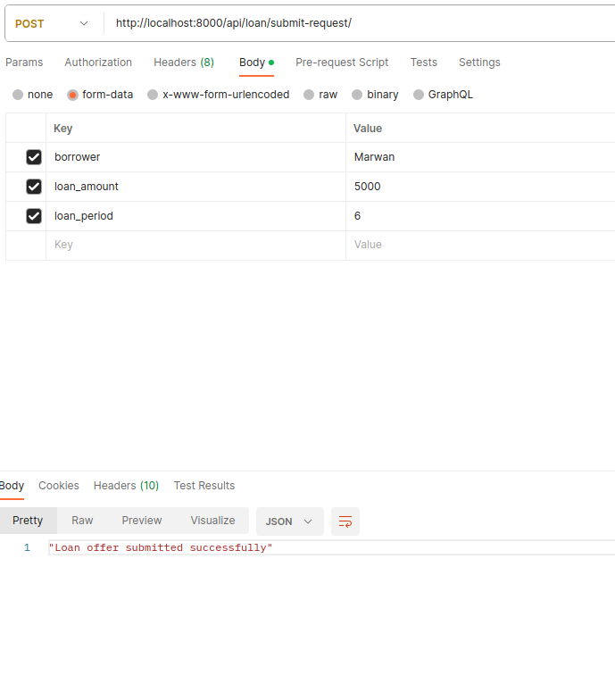
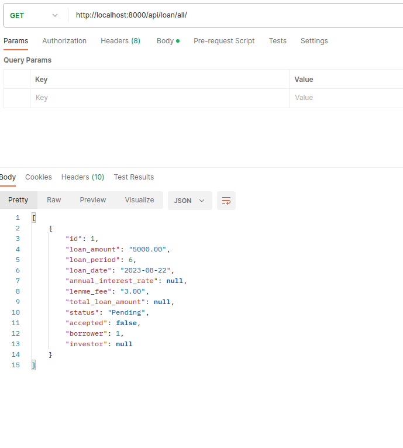
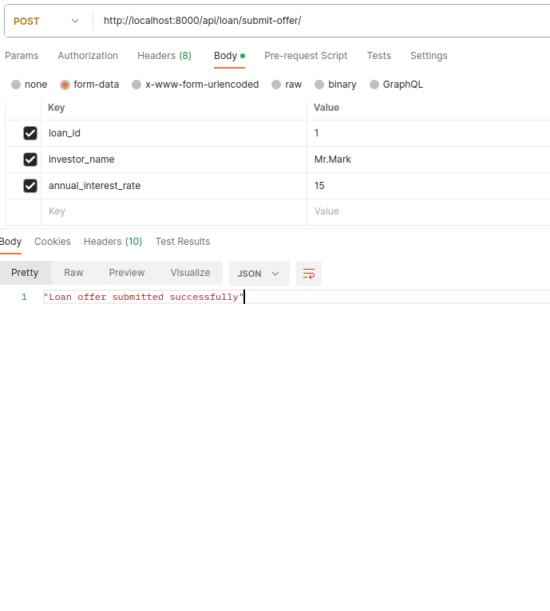
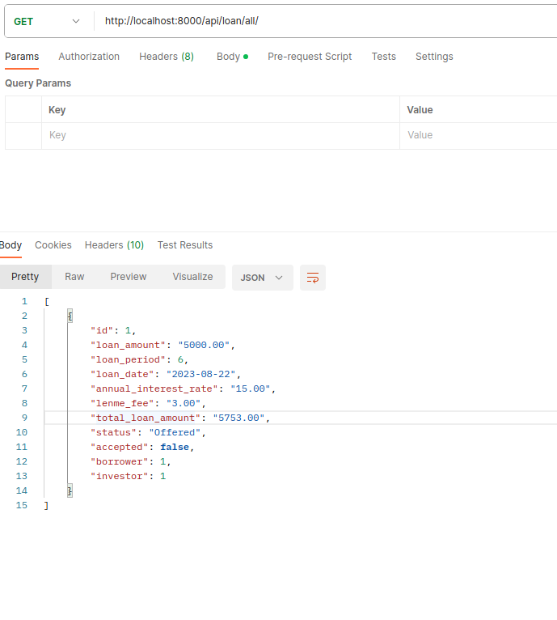
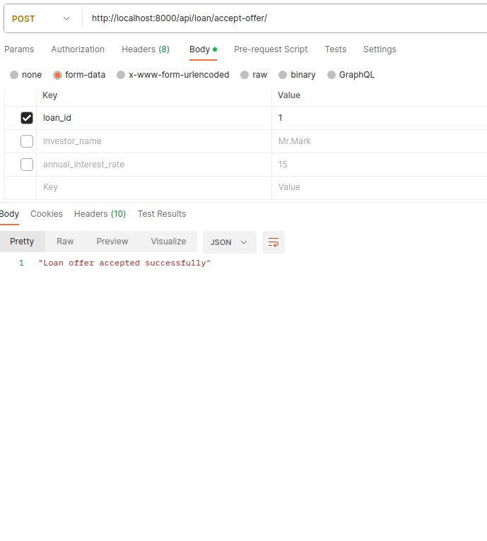
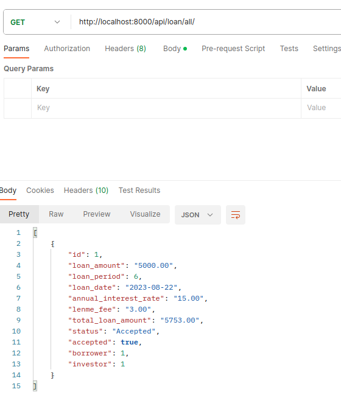
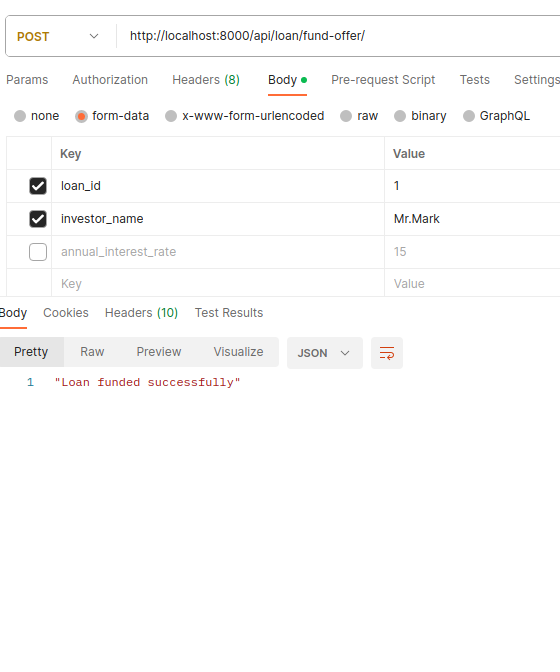
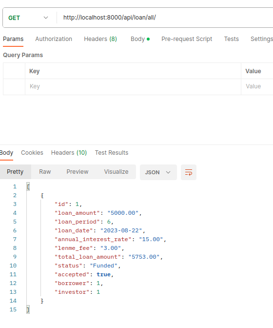

# Loan Management System API

This is a simple Loan Management System API that allows users to submit loan requests, submit loan offers, accept loan offers, fund loans, and retrieve information about loans. The API is built using Django REST framework and uses Celery for scheduling loan payments.


## Installation

1. Clone the repository
2. Create a virtual environment and activate it
3. Install the requirements
4. Run the migrations
5. Run the server

```bash
git clone
cd Loan_API
python -m venv venv
source venv/bin/activate
pip install -r requirements.txt
python manage.py migrate
python manage.py runserver
```

## API Endpoints

1. Submit Loan Request

- Endpoint: `/api/submit_loan_request/`
- Method: `POST`
- Description: Allows borrowers to submit loan requests.
- Request Body:
    `borrower` (string): The name of the borrower.
    `loan_amount` (float): The requested loan amount.    
    `loan_period` (integer): The loan period in months.
- Response:
    200 OK: Loan request submitted successfully.
    400 Bad Request: Invalid loan request.


2. Submit Loan Offer

- Endpoint: /api/submit_loan_offer/
- Method: POST
- Description: Allows investors to submit loan offers.
- Request Body:
    `loan_id` (integer): The ID of the loan.
    `investor_name` (string): The name of the investor.
    `annual_interest_rate` (float): The annual interest rate offered by the investor.
- Response:
    200 OK: Loan offer submitted successfully.
    400 Bad Request: Invalid loan or investor.


3. Accept Loan Offer

- Endpoint: /api/accept_loan_offer/
- Method: POST
- Description: Allows borrowers to accept loan offers.
- Request Body:
    `loan_id` (integer): The ID of the loan.
- Response:
    200 OK: Loan offer accepted successfully.
    400 Bad Request: Invalid loan.

4. Fund Loan

- Endpoint: /api/fund_loan/
- Method: POST
- Description: Allows investors to fund loans.
- Request Body:
    `loan_id` (integer): The ID of the loan.
    `investor_name` (string): The name of the investor.
- Response:
    200 OK: Loan funded successfully.
    400 Bad Request: Invalid loan or investor.
    400 Bad Request: Insufficient balance.

5. Get All Loans

- Endpoint: /api/get_all_loans/
- Method: GET
- Description: Retrieves information about all loans in the system.
- Response:
    200 OK: Returns a list of all loans in the system.


## Testing the API

You can test the API using a tool like Postman. Here are some example screenshots of API responses:


1. Submit Loan Request and get the loan






2. Submit Loan Offer and get the loan





3. Accept Loan Offer and get the loan






4. Fund Loan and get the loan






## Scheduling Loan Payments

Loan payments are scheduled using Celery


## Authentication and Authorization

This API does not currently implement authentication or authorization. Users are created manually in the database, and there are no access controls in place. This is something that can be implemented in the future.


